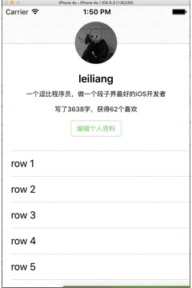

# JSHeaderView

Demo样式如下:



之前也看到过有人实现这个视图，但是大部分都没有对其进行封装，还需要在controller中写大量的代码，大家使用起来很不方便，封装之后的使用方法如下：

```
self.headerView = [[JSHeaderView alloc] initWithImage:[UIImage imageNamed:@"header.jpg"]];
// 这个方法不需要在- (void)scrollViewDidScroll:(UIScrollView *)scrollView;方法中调用
[self.headerView reloadSizeWithScrollView:self.tableView];
self.navigationItem.titleView = self.headerView;
```
只需要这三行代码就可以实现头像缩放的这一效果，如果你需要对头像进行点击，一行代码就可以搞定：
```
[self.headerView handleClickActionWithBlock:^{
    NSLog(@"您点击了头像");
}];
```


只要这几句代码就可以了，是不是很简单呢，如果您喜欢这个Demo的话，请给个star奥 😊!!!
